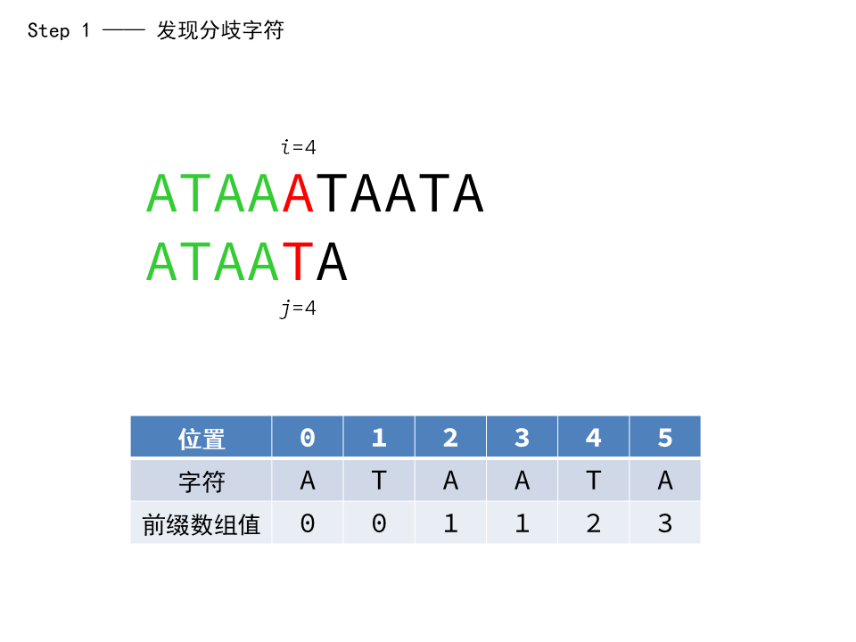
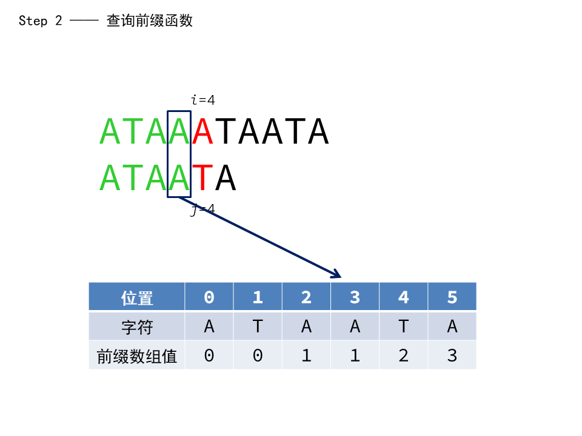
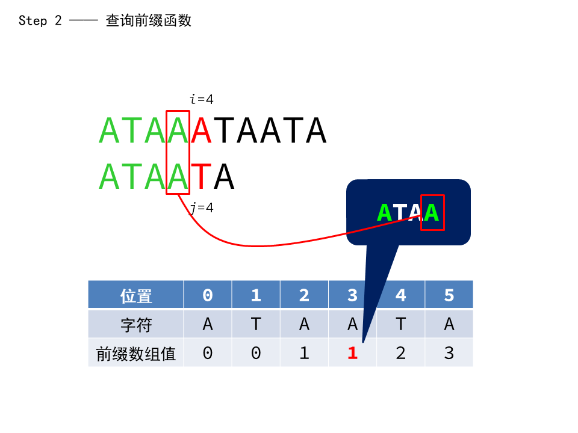
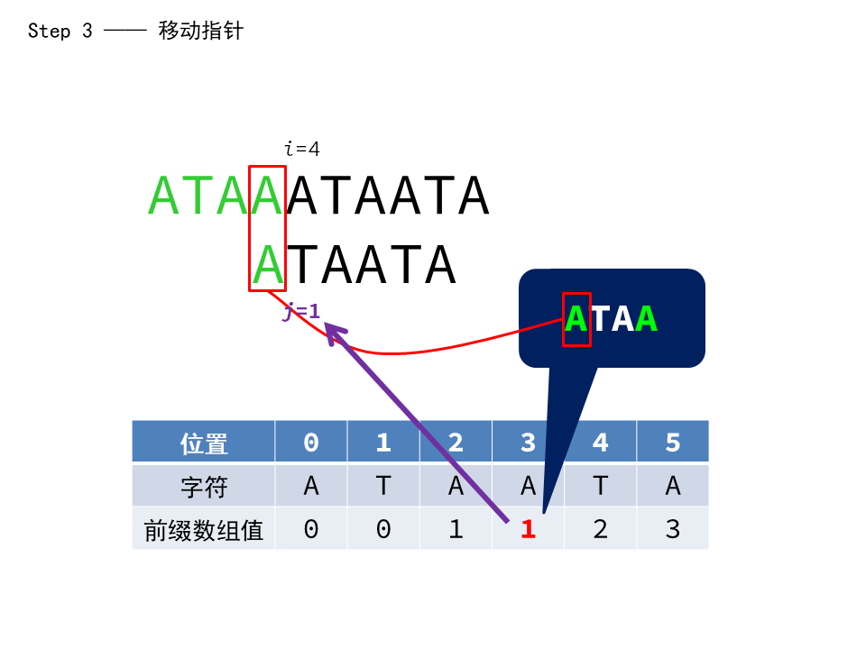

- 模板题目：[LibreOJ #103](https://loj.ac/p/103) 或 [洛谷 P3375](https://www.luogu.com.cn/problem/P3375) 或 [AcWing 831](https://www.acwing.com/problem/content/833/)

> 求给定的字符串 $s$ 作为子串在另一个给定的字符串 $t$ 中所有出现的位置。

## 朴素算法

对于这个问题，最朴素的方法莫过于暴力枚举，也就是分别从 $t$ 的每一个位置开始遍历，逐位比较当前字符与 $s$ 中对应字符是否相匹配。代码写起来很无脑：

```cpp
string s, t;

int main() {
    ios::sync_with_stdio(false);
    cin.tie(nullptr);

    cin >> s >> t;
    int n = s.length(), m = t.length();

    for (int i = 0; i < m - n; i++) {
        bool flag = true;
        for (int j = 0; j < n; j++)
            if (s[j] != t[i + j]) {
                flag = false;
                break;
            }
        if (flag)
            cout << i << endl;
    }

    return fflush(stdout), 0;
}
```

以上代码的复杂度近似为 $\mathcal{O}(nm)$，也就是两个字符串长度的乘积。在给出的模板题中，$1 \leqslant n, m \leqslant 10^6$，朴素算法显然是无法在时限内得出结果的。

## 前缀函数

> 本节中，默认一个字符串的起始位置（下标）为 $0$。

先来看看朴素算法具体是如何得出结果的。朴素算法的逻辑是，假如两个字符串之间出现了分歧，那么直接从头重新开始新一轮枚举。不过现在，假如我们可以根据已经遍历过的字符直接确定出接下来要把指针移动到什么位置去，就可以节省朴素算法每次将指针回退到开头、逐位枚举所造成的时间浪费。这就是接下来要介绍的 KMP 模式匹配算法降低复杂度的底层逻辑。不过在此之前，我们还要先引入**前缀函数**这样一个概念。

对于字符串 $s$，可以构造一个数组 $\pi$，其中每一个元素 $\pi[i]$ 存储由 $s[0]$ 到 $s[i]$ 这 $i+1$ 个字符组成的子串中的真前缀与真后缀相等时它们的长度。

比如字符串 `ATAATA` 可以构建出的 $\pi$ 数组为 $\left \lbrace 0, 0, 1, 1, 2, 3 \right \rbrace$，这 $6$ 个数分别表示子串为 `A`、`AT`、`ATA`、`ATAA`、`ATAAT` 和 `ATAATA` 时，子串的真前缀与真后缀（字符串**真前、后缀**的概念，可以类比数组中**前、后缀和**以及集合论中**真**子集的概念）相等时它们的长度：

- `A` 没有真前缀和真后缀，存储为 $0$；
- `AT` 的真前缀与真后缀均不相等，存储为 $0$；
- `ATA` 的最长相等真前、后缀为 `A`，长度为 $1$；
- `ATAA` 的最长相等真前、后缀也为 `A`，长度为 $1$；
- `ATAAT` 的最长相等真前、后缀为 `AT`，长度为 $2$；
- `ATAATA` 的最长相等真前、后缀为 `ATA`，长度为 $3$。

这样的数组 $\pi$，我们称之为字符串 $s$ 的前缀函数。

然后拿 $s$ 与 $t$ 进行匹配，但是同时借助前缀函数来确定指针移动的位置。我们以 $s = \texttt{ATAATA}$、$t = \texttt{ATAAATAATA}$ 为例 。将 $i$ 与 $j$ **同时**从各自字符串的开头向后移动，直到出现分歧。

```text
    i
ATAAATAATA
ATAATA
    j
```

然后我们查看 $s$ 中分歧前一位的位置 $3$ 在 $\pi$ 数组中存储的值，即 $\pi[3] = 1$，再将 $j$ 移动到 $s$ 的 $1$ 位置：

```text
    i
ATAAATAATA
   ATAATA
    j
```

可以看到，这个时候，$s$ 中的第一个字符没有经过重新遍历就已经匹配上了！这是巧合吗？并不是。

联系 $\pi$ 数组的定义，我们可以发现，这一效果得以实现的原因是，分歧字符之前的 `ATAA` 这个子串的最长相等真前、后缀的长度为 $1$，也就是说，由于我们先前已经确认 $s$ 与 $t$ 的前 $4$ 个字符相同，其中最长相等真前、后缀的长度都为 $1$，即 $s$ 的第 $0$ 个位置和第 $3$ 个位置 、$t$ 的第 $0$ 个位置和第 $3$ 个位置的字符相同。那么那么出现分歧之后，就可以直接根据 $s$ 的第 $0$ 个位置的 `A` 与 $t$ 第 $3$ 个位置的 `A` 相匹配，把整个字符串向后移动到下一个位置，也就是把 $j$ 指针移动到 $\pi[3] = 1$ 的位置。

具体可以看下面的图示：








从这个意义上来说，$\pi$ 数组存储的值实际上是当前长度的子串中，最长相等真前、后缀的长度 $+1$ 之后在原子串里的位置。在这个位置之前的 $s$ 中第 $0$ 个位置一直到第 $\pi[i]$ 个位置的所有字符所构成的子串，与 $t$ 中第 $i - \pi[i]$ 个位置一直到第 $i - 1$ 个位置的所有字符所构成的子串，是完全相同的。因此我们可以把 $s[0] \sim s[\pi[i]]$ 移动到 $t[i-\pi[i]] \sim t[i-1]$ 的位置上（在图形中是把整个 $s$ 字符串向后移动，代码里通过调整 $j$ 指针位置来实现），而不需要重新去遍历之前的每一个字符。

---

说了这么多，那么 $s$ 的前缀函数到底如何用程序计算出来呢？

朴素算法显然可以很容易地解决这个问题，但是同样需要对 $s$ 进行两次扫描，时间复杂度约为 $\mathcal{O}(n^2)$，显然是不过关的。我们还是可以用 $i$ 和 $j$ 指针向后移动的方法进行匹配，但是二者分别扫描各自的 $s$ 字符串，具体方法如下：（$s = \texttt{ABACABA}$，$\pi[0]$ 默认为 $0$）

```text
 i
ABACABA
 ABACABA
 j
```

我们从 $i=1, j = 0$ 开始扫描（$i$ 如果从头开始扫描，那么 $i$ 和 $j$ 扫描到的字符一定会匹配，因为本来就是两个相同的字符串在相互匹配） ，发现第一个字符就出现了分歧，这意味着 $\pi[1] = 0$，因为 $i$ 后的所有字符所组成的后缀与 $j$ 及其之前所有字符组成的前缀并不相同。我们把 $0$ 存入 $\pi[1]$ 的位置上，然后让 $i$ 向后移一位（$j$ 只在匹配到相同字符之后才向后移）。

```text
  i
ABACABA
  ABACABA
  j
```

两个位置相同，所以 $\pi[2] = 1$，表示找到了 `ABA` 中的一个最长相等前、后缀 `A`，其长度为 $1$。然后就可以将 $i$ 与 $j$ 同时向后移动了。

```text
   i
ABACABA
  ABACABA
   j
```

显见这两个字符不同，此时我们需要在已有的 $\pi$ 数组中查找，看能不能将 $j$ 所在的 $s$ 字符串向后移动到下一个匹配过的位置。这里的原理与实现方法，和前面提到的匹配 $t$ 与 $s$ 的原理和方法是一致的，我们查询 $\pi$ 数组的目的，是为了节省朴素算法中从头开始遍历所浪费掉的时间。不过这里，由于 $\pi[j-1] = \pi[0] = 0$，意味着我们遍历过的字符中，找不到下一个字符来让我们直接移动 $j$ 指针以使 $j$ 所在的 $s$ 字符串开头与 $i$ 所在的 $s$ 字符串中遍历过的字符相匹配的位置了（$j$ 所在 $s$ 字符串前缀的 `A` 已经与 `ABA` 中后缀里的 `A` 的位置重合了）。所以我们还是把 $j$ 设为 $\pi[0] = 0$，从 $j$ 所在 $s$ 字符串的开头重新开始遍历。

```text
   i
ABACABA
   ABACABA
   j
```

还是不匹配，设 $\pi[3] = 0$。将 $i$ 向后移动。

```text
    i
ABACABA
    ABACABA
    j
```

发现匹配，设 $\pi[4] = 1$。将 $i$ 和 $j$ 同时向后移动，直到结尾，就可以得出 $\pi[5] = 2$ 和 $\pi[6] = 3$。

从上面的例子中，我们可以看出，如果不匹配，就将 $\pi[i]$ 设为 $0$，仅移动 $i$ 指针，并且如果 $j \ne 0$，就根据 $\pi$ 数组中已有的值让 $j$ 指针**向前**返回到下一个可能出现匹配的位置；否则，$\pi[i] = j +1$，也就是在之前最大长度的基础上加上这新遍历到的一个字符。

这就是 KMP 模式匹配算法背后的原理。

## 代码实现

综合一下之前的推理，我们可以把代码分成几个步骤：

- 计算 $s$ 的前缀数组 $\pi$：
  - 如果当前位置字符不匹配，$j$ 指针回溯到下一个可能出现匹配的位置；
  - 如果成功匹配，$j$ 指针移动到下一位；
  - 存储 $\pi[i]$ 的值。
- 在 $t$ 中查找 $s$：
  - 如果当前位置字符不匹配，$j$ 指针回溯到下一个可能出现匹配的位置；
  - 如果成功匹配，$j$ 指针移动到下一位；
  - 如果 $j$ 指针已经成功到了 $s$ 串末尾，则输出所在位置并回溯到下一个可能出现匹配的位置（因为 $t$ 中的 $s$ 串可能重叠），继续匹配。

```cpp
const int N = 1e6 + 10;
int pi[N];
string s, t;

int main() {
    ios::sync_with_stdio(false);
    cin.tie(nullptr);

    cin >> s >> t;
    int n = s.length(), m = t.length();

    for (int i = 1, j = 0; i < n; i++) {
        while (j > 0 && s[j] != s[i])
            j = pi[j - 1];
        if (s[j] == s[i])
            j++;
        pi[i] = j;
    }

    for (int i = 0, j = 0; i < m; i++) {
        while (j > 0 && t[i] != s[j])
            j = pi[j - 1];
        if (t[i] == s[j])
            j++;
        if (j == n) {
            cout << i - j + 1 << ' ';
            j = pi[j - 1];
        }
    }

    return fflush(stdout), 0;
}
```
